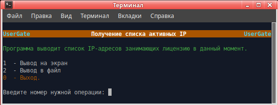

<h2 align="center">Получение списка активных IP-адресов на UTM UserGate (Версия 0.3).</h2>

Программа предназначена для оперативного получения списка активных IP-адресов, занимающих лицензию
на NGFW UserGate. Вывод осуществляется в окно терминала или в файл по выбору. Вывод сохраняется в
файл вида <i>active_ips (date_time)</i> в каталог data в текущей директории.

Программа работает в Linux.
Скачать архив <b>view_lic_ip.zip</b>, распаковать, файл <b>view_lic_ip</b> сделать исполняемым.
Запустить <b>view_lic_ip</b> в терминале.

Программа Запрашивает ip узла, login и пароль администратора UTM.

Программа работает только на UG NGFW версии 6. Для работы программы на интерфейсе, к которому производится
подключение, необходимо включить сервис xml-rpc. Если используется зона Management, то этого делать не надо,
так как сервис xml-rpc на интерфейсе Management включён по умолчанию.

Включение сервиса xml-rpc на зоне:
1. Открыть веб-консоль администратора таким образом: https://<usergate_ip>:8001/?features=zone-xml-rpc
2. В настройках нужной зоны активировать сервис "XML-RPC для управления".

<b>Примечание:</b>
Если версия вашего UG NGFW меньше чем 6.1.5.11048, обратитесь в техподдержку UserGate для включения
необходимых API.