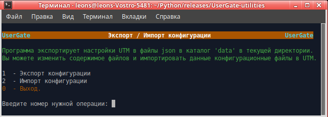

<h3>Экспорт/импорт конфигурации UTM UserGate</h3>

Программа предназначена для переноса конфигурации с UTM версии 5 на версию 6 или между UTM 6-ой версии.

При экспорте создаются файлы в формате json с конфигурацией разделов.
Можно экспортировать настройки, затем внести необходимые изменения. Затем импортировать изменённые файлы конфигурации.

Запускать в терминале.

Программа Запрашивает ip узла, login и пароль администратора UTM.

Для работы программы На интерфейсе UTM необходимо включить сервис xml-rpc.
1. Открыть веб-консоль администратора таким образом: https://<usergate_ip>:8001/?features=zone-xml-rpc
2. В настройках нужной зоны активировать сервис "XML-RPC для управления".

<b>Примечания:</b>
1. Раздел Библиотеки "Профили СОВ": не импортируются сигнатуры профилей СОВ с версии 5 на версию 6, так как
в 6-ой версии структура и состав сигнатур кардинально поменялись.

06.07.2021  Добавлен экспорт/импорт локальных пользователей и групп. 
07.07.2021  Добавлен экспорт/импорт настроек NTP, модулей, кеширования HTTP из раздела "Настройки".