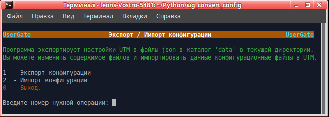

<h3>Экспорт/импорт конфигурации UTM UserGate</h3>

Программа предназначена для переноса конфигурации с UTM версии 5 на версию 6 или между UTM 6-ой версии.

При экспорте создаются файлы в формате json с конфигурацией разделов.
Можно экспортировать настройки, затем внести необходимые изменения. Затем импортировать изменённые файлы конфигурации.

Скачать архив <b>ug_convert_config.zip</b>, распаковать, файл <b>ug_convert_config.py</b> сделать исполняемым.
Запустить <b>ug_convert_config.py</b> в терминале. Программа работает в Linux.

Программа Запрашивает ip узла, login и пароль администратора UTM.

Для работы программы На интерфейсе UTM необходимо включить сервис xml-rpc.
1. Открыть веб-консоль администратора таким образом: https://<usergate_ip>:8001/?features=zone-xml-rpc
2. В настройках нужной зоны активировать сервис "XML-RPC для управления".

Если у Вас в правилах используются доменные пользователи и группы, то при импорте необходимо в первую очередь
импортировать настройки DNS, затем список серверов авторизации LDAP. После этого настроить нужный LDAP-коллектор.
Затем можно выбрать "Импортировать всё".

Экспорт из правил и импорт доменных пользователей и групп в правила возможен только при использовании версии
UTM равной 5.0.6.4865 или выше, если экспорт производится из 5-ой версии и 6.1.3.10697 или выше для импорта и
экспорта. 

<b>Примечания:</b>
1. Раздел Библиотеки "Профили СОВ": не импортируются сигнатуры профилей СОВ с версии 5 на версию 6, так как
в 6-ой версии структура и состав сигнатур кардинально поменялись.
2. Если вы делаете импорт не всей конфигурации, то необходимо учитывать, что разделы конфигурации взаимосвязаны друг
с другом. Поэтому импорт определённого пункта меню пройдёт без ошибок только если ранее был выполнен импорт
всех предыдущих пунктов этого меню и всех пунктов вышележащих меню.
3. Если существуют правила МЭ с одинаковыми именами, то при конвертации к имени такого правило добавляется номер,
что бы имена были уникальными.
4. Пробелы в начале и конце имён правил, списков и т.д. при конвертации удаляются.
5. Имена списков IP-адресов типа "10.10.10.0/24" заменяются на "10.10.10.0_24" так как при переносе каждый список
записывается в отдельный файл с данным именем, а в файловой системе Linux прямой слеж является разделителем пути к файлу.
6. После импорта настроек BGP в свойсвах каждого из bgp-соседей надо заново ввести пароль.

06.07.2021  Добавлен экспорт/импорт локальных пользователей и групп. 
07.07.2021  Добавлен экспорт/импорт настроек NTP, модулей, кеширования HTTP из раздела "Настройки". 
12.07.2021  Добавлен экспорт/импорт настроек DNS из раздела "Сеть". 
13.07.2021  Добавлен экспорт/импорт серверов авторизации из раздела "Пользователи и устройства". 
14.07.2021  Добавлен экспорт/импорт профилей MFA из раздела "Пользователи и устройства". 
15.07.2021  Добавлен экспорт/импорт профилей авторизации из раздела "Пользователи и устройства". 
16.07.2021  Добавлен экспорт/импорт Captive-профилей из раздела "Пользователи и устройства". 
16.07.2021  Переделан импорт DHCP. 
20.07.2021  Добавлен экспорт/импорт правил Captive-портала из раздела "Пользователи и устройства". 
26.07.2021  Добавлен импорт доменных пользователей в локальные группы (при экспорте из 6-ой версии). 
27.07.2021  Добавлен Экспорт/импорт Политик BYOD из раздела "Пользователи и устройства". 
30.07.2021  Добавлен Экспорт/импорт Сценариев из раздела "Политики безопасности". 
30.07.2021  Добавлен Экспорт/импорт правил межсетевого экрана из раздела "Политики сети". 
04.08.2021  Добавлен Экспорт/импорт правил "NAT и маршрутизация" из раздела "Политики сети". 
05.08.2021  Добавлен Экспорт/импорт правил "Балансировка нагрузки" из раздела "Политики сети". 
06.08.2021  Добавлен Экспорт/импорт списка "ICAP-серверы" из раздела "Политики безопасности". 
06.08.2021  Добавлен Экспорт/импорт списка "ICAP-правила" из раздела "Политики безопасности". 
09.08.2021  Добавлен Экспорт/импорт списка "Пропускная способность" из раздела "Политики сети". 
10.08.2021  Добавлен Экспорт/импорт правил "Фильтрация контента" из раздела "Политики безопасности". 
11.08.2021  Добавлен Экспорт/импорт правил "Веб-безопасность" из раздела "Политики безопасности". 
11.08.2021  Добавлен Экспорт/импорт правил "Инспектирование SSL" из раздела "Политики безопасности". 
11.08.2021  Добавлен Экспорт/импорт правил "Инспектирование SSH" из раздела "Политики безопасности". 
12.08.2021  Добавлен Экспорт/импорт правил "СОВ" из раздела "Политики безопасности". 
12.08.2021  Добавлен Экспорт/импорт списка "Правила АСУ ТП" из раздела "Политики безопасности". 
13.08.2021  Добавлен Экспорт/импорт правил "Защита почтового трафика" из раздела "Политики безопасности". 
16.08.2021  Добавлен Экспорт/импорт списка "Профили DoS" из раздела "Политики безопасности". 
16.08.2021  Добавлен Экспорт/импорт списка "Правила защиты DoS" из раздела "Политики безопасности". 
17.08.2021  Добавлен Экспорт/импорт списка "Веб-портал" из раздела "Глобальный портал". 
17.08.2021  Добавлен Экспорт/импорт списка "Серверы reverse-прокси" из раздела "Глобальный портал". 
17.08.2021  Добавлен Экспорт/импорт списка "Правила reverse-прокси" из раздела "Глобальный портал". 
18.08.2021  Добавлен Экспорт/импорт списка "Профили безопасности VPN" из раздела "VPN". 
18.08.2021  Добавлен Экспорт/импорт списка "Сети VPN" из раздела "VPN". 
19.08.2021  Добавлен Экспорт/импорт списка "Серверные правила" из раздела "VPN". 
19.08.2021  Добавлен Экспорт/импорт списка "Клиентские правила" из раздела "VPN". 
19.08.2021  Добавлен Экспорт/импорт настроек интерфейса веб-консоли из раздела "UserGate/Настройки". 
19.08.2021  Добавлен Экспорт/импорт списка "Профили администраторов" из раздела "UserGate/Администраторы". 
20.08.2021  Добавлен Экспорт/импорт настроек Веб-портала из раздела "UserGate/Настройки". 
20.08.2021  Добавлен Экспорт/импорт настроек паролей администраторов из раздела "UserGate/Администраторы". 
23.08.2021  Добавлен Экспорт/импорт списка администраторов UTM из раздела "UserGate/Администраторы". 
24.08.2021  Добавлен Экспорт/импорт списка "Шлюзы" из раздела "Сеть". 
24.08.2021  Добавлен Экспорт/импорт настроек "Проверка сети" из раздела "Сеть/Шлюзы". 
25.08.2021  Добавлен Экспорт списка "Интерфейсы" из раздела "Сеть". 
27.08.2021  Добавлен update сетевых адаптеров и импорт bond интерфейсов из раздела "Сеть". 
30.08.2021  Исправлена выгрузка сервисов раздела библиотеки. 
30.08.2021  Добавлен импорт интерфейсов bridge, pppoe, vlan, tunnel, vpn из раздела "Сеть". 
02.09.2021  Исправлена выгрузка списка IP-адресов, содержащих "/" в имени списка. 
02.09.2021  Добавлен экспорт/импорт списка "WCCP" из раздела "Сеть". 
07.09.2021  Исправлена выгрузка очень большого количества разных списков. 
07.09.2021  Добавлен экспорт/импорт списка "Маршруты" из раздела "Сеть". 
13.09.2021  Добавлен экспорт/импорт настроек OSPF, BGP из раздела "Сеть". 
