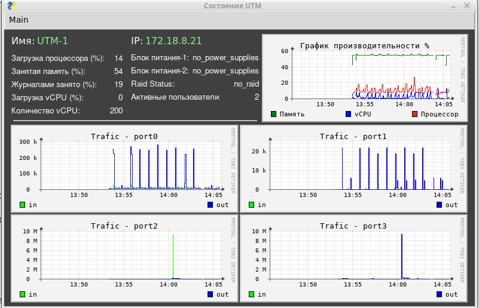

<h2 align="center">Опрос UTM UserGate по SNMP.</h2>
<h3 align="center">(Версия 2.1)</h3>

Программа предназначена для оперативного получения текущего состояния Межсетевого экрана UserGate версии 6.

Программа работает в Ubuntu версии 22.04.01 или выше. 

Опрос производиться по SNMP c UserGate NGFW версии 6. Выводяться следующие параметры:
- загрузка процессора;
- занятая оперативноя память;
- объём дискового пространства, занятое журналами;
- использование vCPU;
- число задействованных vCPU;
- состояние блоков питания;
- состояние массива Raid;
- число активных пользователей;
- трафик на сетевых интерфейсах.

Установка:
1. Скачать архив ug_view.zip, распаковать.
2. Файл ug_view.py сделать исполняемым.
3. Запустить ug_view.py.

После первоначального запуска выводится окно ввода настроек. Необходимо ввести:
- имя устройства,
- IP адрес,
- community.

После нажатия на кнопку "Save", происходит запоминание настроек в файле ug_view.json. Данный файл создаётся в директории программы.

На UTM в разделе "Диагностика и мониторинг" --> "SNMP" в правиле snmp надо поставить версию: "SNMP v2".
На вкладке "События" включить:
- Таблица статистики сетевых интерфейсов;
- Загрузка vCPU;
- Количество vCPU;
- Изменён статус RAID;
- Изменён статус блока питания;
- Высокая загрузка процессора;
- Высокая загрузка памяти;
- Недостаточно места в разделе для журналов;
- Количество лицензий использовано.
