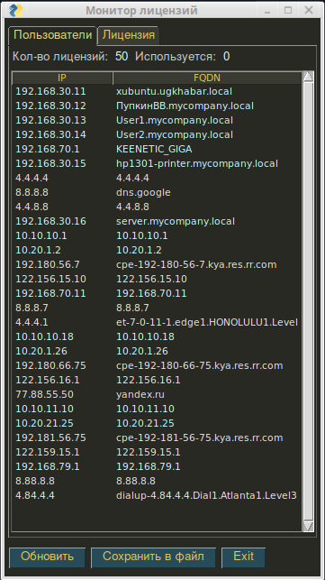

<h2 align="center">Получение списка активных IP-адресов на UTM UserGate.</h2>
<h3 align="center">(Версия 1.0)</h3>

Программа предназначена для оперативного получения списка активных IP-адресов, занимающих лицензию
на NGFW UserGate. Можно сохраняеть список IP-адресов в файл вида <i>"active_ips (date_time).txt"</i> в каталог
<b>data<b> в текущей директории. Так же программа выводит сведения о текущей лицензии UTM.

Программа работает в Linux и Windows.
Скачать архив <b>ug_view_license.zip</b>, распаковать.
1. В Linux файл <b>ug_view_license</b> сделать исполняемым, запустить <b>ug_view_license</b> в терминале или сделать ярлык на рабочий стол.
2. В Windows файл <b>ug_view_license.exe</b> сделать исполняемым, запустить <b>ug_view_license.exe</b>

Программа Запрашивает ip узла, login и пароль администратора UTM.

Программа работает только на UG NGFW версии 6. Для работы программы на интерфейсе, к которому производится
подключение, необходимо включить сервис xml-rpc. Если используется зона Management, то этого делать не надо,
так как сервис xml-rpc на интерфейсе Management включён по умолчанию.

Включение сервиса xml-rpc на зоне:
1. Открыть веб-консоль администратора таким образом: https://<usergate_ip>:8001/?features=zone-xml-rpc
2. В настройках нужной зоны активировать сервис "XML-RPC для управления".

<b>Примечание:</b>
Если версия вашего UG NGFW меньше чем 6.1.5.11048, обратитесь в техподдержку UserGate для включения
необходимых API.